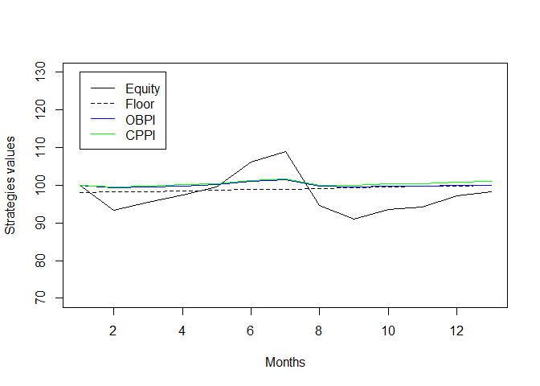
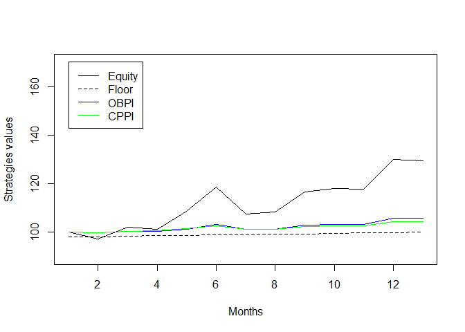
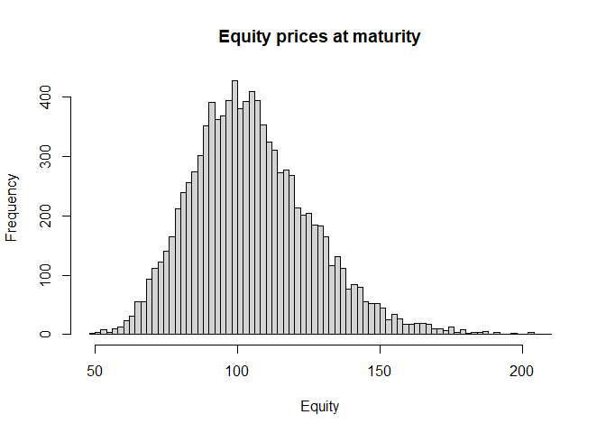
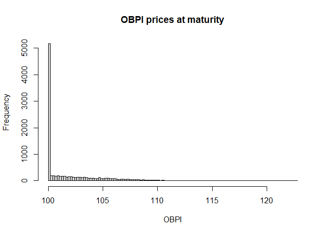
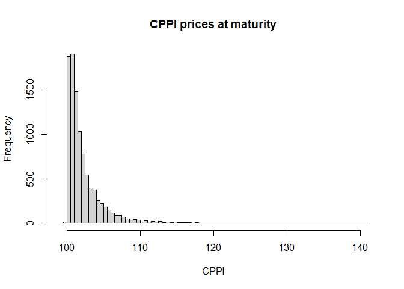

Workshop 3 - Portfolio insurance strategies
================
Pierre Clauss
October 2025

*The following R Markdown document has to be read with my course notes
(in particular for the details of the analysis framework).*

*Not all the R codes are displayed but only some of them to help you to
succeed the workshop.*

## Foreword

There is no data steps in this workshop. I give you the annualised
expected return and volatility of the asset to be insured:


``` r
library(tidyverse)
library(scales)
mu <- 0.05
sigma <- 0.20
```

## 1 Analysis framework

I focus on 2 approaches to insure my capital:

1.  Option-Based Portfolio Insurance with a call
2.  Constant-Proportion Portfolio Insurance

*See my course notes for the details of all the formulas.*

## 2 Simulation methodologies

As I want to simplify the workshop using gaussian simulations, I
simulate monthly returns which could be considered more gaussian than
daily or weekly returns. As an alternative not studied here, we could
use more complex modelling with mixtures of gaussian distributions or
Student distributions family.

The maturity of insurance capital is 1 year.

The other assumptions are:


``` r
delta <- 1 / 12
mat <- 1
rf <- 0.02
strike <- 100
stress <- 0.20
tol <- 0
```

### 2.1 An example with two simulated tracks

The simulation seeds are respectively 1234 and 123.

``` r
set.seed(1234)

n <- mat / delta
u <- runif(n)

# Moments on simulation path
rf1 <- (1 + rf) ^ delta - 1
mu1 <- (1 + mu) ^ delta - 1
sigma1 <- sigma * sqrt(delta)

# Stock simulation
r <- qnorm(u, mu1, sigma1)
rPRN <- qnorm(u, rf1, sigma1)

equity <- numeric(n + 1)
equityRNP <- numeric(n + 1)
equity[1] <- strike
equityRNP[1] <- strike

for (i in 1:n)
{
  equity[i + 1] <- equity[i] * (1 + r[i])
  equityRNP[i + 1] <- equityRNP[i] * (1 + rPRN[i])
}

# Call simulation
call <- numeric(n + 1)
call[n + 1] <- max(0, equityRNP[n + 1] - strike)

for (i in 1:n)
{
  d0 <-
    ((rf - sigma ^ 2 / 2) * (mat - (i - 1) * delta) + log(equityRNP[i] / strike)) /
    (sigma * sqrt(mat - (i - 1) * delta))
  d1 <- d0 + sigma * sqrt(mat - (i - 1) * delta)
  call[i] <-
    equityRNP[i] * pnorm(d1) - strike * exp(-rf * (mat - (i - 1) * delta)) *
    pnorm(d0)
}

# Floor simulation
floor <- numeric(n + 1)

for (i in 1:(n + 1))
{
  floor[i] <- strike / (1 + rf) ^ (mat - (i - 1) * delta)
}

# OBPI simulation
obpi_call <- numeric(n + 1)
obpi_call[1] <- strike
gearing <- (obpi_call[1] - floor[1]) / call[1]

for (i in 1:n)
{
  obpi_call[i + 1] <- floor[i + 1] + gearing * call[i + 1]
}

# CPPI simulation
cppi <- numeric(n + 1)
cushion <- numeric(n + 1)
multiplier <- numeric(n + 1)
expo_exante <- numeric(n + 1)
expo_expost <- numeric(n + 1)
cppi[1] <- strike
cushion[1] <- cppi[1] - floor[1]
multiplier[1] <- 1 / stress
expo_exante[1] <- multiplier[1] * cushion[1]
expo_expost[1] <- expo_exante[1]
boundary_inf <- multiplier[1] * (1 - tol)
boundary_sup <- multiplier[1] * (1 + tol)

for (i in 1:n)
{
  expo_exante[i + 1] <- expo_expost[i] * equity[i + 1] / equity[i]
  cppi[i + 1] <-
    expo_exante[i + 1] + (cppi[i] - expo_expost[i]) * floor[i + 1] / floor[i]
  cushion[i + 1] <- cppi[i + 1] - floor[i + 1]
  multiplier[i + 1] <- expo_exante[i + 1] / cushion[i + 1]
  expo_expost[i + 1] <-
    ifelse(
      multiplier[i + 1] < boundary_inf ||
        multiplier[i + 1] > boundary_sup,
      multiplier[1],
      multiplier[i + 1]
    ) * ifelse(cushion[i + 1] < 0, 0, cushion[i + 1])
}

plot(equity, type = 'l', ylab = 'Strategies values', xlab = 'Months', ylim = c(70, 130))
lines(floor, lty = 2)
lines(obpi_call, col = 'blue')
lines(cppi, col = 'green')
leg.txt <- c("Equity", "Floor", "OBPI", "CPPI")
legend(1, 130, leg.txt, col = c("black", "black", "blue", "green"), lty = c(1, 2, 1, 1))
```

<!-- -->

<!-- -->

### 2.2 Monte-Carlo simulations

The number of Monte-Carlo simulations is
.

``` r
nsimul <- 10000
```

``` r
n <- mat / delta
u <- matrix(0, n, nsimul)

for (j in 1:nsimul)
{
  u[, j] <- runif(n)
}

# Moments on simulation path
rf1 <- (1 + rf) ^ delta - 1
mu1 <- (1 + mu) ^ delta - 1
sigma1 <- sigma * sqrt(delta)

# Stock simulation
r <- qnorm(u, mu1, sigma1)
rRNP <- qnorm(u, rf1, sigma1)

equity <- matrix(0, n + 1, nsimul)
equityRNP <- matrix(0, n + 1, nsimul)
equity[1,] <- strike
equityRNP[1,] <- strike

for (i in 1:n)
{
  for (j in 1:nsimul)
  {
    equity[i + 1, j] <- equity[i, j] * (1 + r[i, j])
    equityRNP[i + 1, j] <- equityRNP[i, j] * (1 + rRNP[i, j])
  }
}

# Call simulation
call <- matrix(0, n + 1, nsimul)

for (j in 1:nsimul)
{
  call[n + 1, j] <- max(0, equityRNP[n + 1, j] - strike)
}

for (i in 1:n)
{
  for (j in 1:nsimul)
  {
    d0 <-
      ((rf - sigma ^ 2 / 2) * (mat - (i - 1) * delta) + log(equityRNP[i, j] /
                                                              strike)) / (sigma * sqrt(mat - (i - 1) * delta))
    d1 <- d0 + sigma * sqrt(mat - (i - 1) * delta)
    call[i, j] <-
      equityRNP[i, j] * pnorm(d1) - strike * exp(-rf * (mat - (i - 1) * delta)) *
      pnorm(d0)
  }
}

# Floor simulation
floor <- numeric(n + 1)

for (i in 1:(n + 1))
{
  floor[i] <- strike / (1 + rf) ^ (mat - (i - 1) * delta)
}

# OBPI simulation
obpi_call <- matrix(0, n + 1, nsimul)
robpi_call <- matrix(0, n, nsimul)
obpi_call[1,] <- strike
gearing <- (obpi_call[1, 1] - floor[1]) / call[1, 1]

for (i in 1:n)
{
  for (j in 1:nsimul)
  {
    obpi_call[i + 1, j] <- floor[i + 1] + gearing * call[i + 1, j]
    robpi_call[i, j] <- obpi_call[i + 1, j] / obpi_call[i, j] - 1
  }
}

# CPPI simulation
cppi <- matrix(0, n + 1, nsimul)
rcppi <- matrix(0, n, nsimul)
cushion <- matrix(0, n + 1, nsimul)
multiplier <- matrix(0, n + 1, nsimul)
expo_exante <- matrix(0, n + 1, nsimul)
expo_expost <- matrix(0, n + 1, nsimul)
cppi[1,] <- strike
cushion[1,] <- cppi[1,] - floor[1]
multiplier[1,] <- 1 / stress
expo_exante[1,] <- multiplier[1,] * cushion[1,]
expo_expost[1,] <- expo_exante[1,]
boundary_inf <- multiplier[1] * (1 - tol)
boundary_sup <- multiplier[1] * (1 + tol)

for (i in 1:n)
{
  for (j in 1:nsimul)
  {
    expo_exante[i + 1, j] <-
      expo_expost[i, j] * equity[i + 1, j] / equity[i, j]
    cppi[i + 1, j] <-
      expo_exante[i + 1, j] + (cppi[i, j] - expo_expost[i, j]) * floor[i +
                                                                         1] / floor[i]
    cushion[i + 1, j] <- cppi[i + 1, j] - floor[i + 1]
    multiplier[i + 1, j] <-
      expo_exante[i + 1, j] / cushion[i + 1, j]
    expo_expost[i + 1, j] <-
      ifelse(
        multiplier[i + 1, j] < boundary_inf ||
          multiplier[i + 1, j] > boundary_sup,
        multiplier[1, j],
        multiplier[i + 1, j]
      ) * ifelse(cushion[i + 1, j] < 0, 0, cushion[i + 1, j])
    rcppi[i, j] <- cppi[i + 1, j] / cppi[i, j] - 1
  }
}

# Monte-Carlo results
fin_return <- matrix(0, nsimul, 3)
price <- matrix(0, nsimul, 3)
vol <- matrix(0, nsimul, 3)
insur <- matrix(0, nsimul, 3)

for (j in 1:nsimul)
{
  price[j, 1] <- equity[n + 1, j]
  price[j, 2] <- obpi_call[n + 1, j]
  price[j, 3] <- cppi[n + 1, j]
  fin_return[j, 1] <- (equity[n + 1, j] / strike) ^ (1 / mat) - 1
  fin_return[j, 2] <- (obpi_call[n + 1, j] / strike) ^ (1 / mat) - 1
  fin_return[j, 3] <- (cppi[n + 1, j] / strike) ^ (1 / mat) - 1
  vol[j, 1] <- sd(r[, j]) / sqrt(delta)
  vol[j, 2] <- sd(robpi_call[, j]) / sqrt(delta)
  vol[j, 3] <- sd(rcppi[, j]) / sqrt(delta)
  insur[j, 1] <- ifelse(price[j, 1] >= strike, 1, 0)
  insur[j, 2] <- ifelse(price[j, 2] >= strike, 1, 0)
  insur[j, 3] <- ifelse(price[j, 3] >= strike, 1, 0)
  
}

ret_MC <- colMeans(fin_return)
vol_MC <- colMeans(vol)
insur_MC <- colSums(insur) / nsimul

results <- as.data.frame(rbind(ret_MC, vol_MC, insur_MC))
colnames(results) <- c("Equity", "OBPI", "CPPI")
rownames(results) <- c("Annualised return", "Volatility", "Insurance rate")
library(pander)
pander(rownames_to_column(results, var = "Indicators"))
```

|    Indicators     | Equity  |  OBPI   |  CPPI   |
|:-----------------:|:-------:|:-------:|:-------:|
| Annualised return | 0.04994 | 0.01999 | 0.02326 |
|    Volatility     | 0.1953  | 0.02631 | 0.02185 |
|  Insurance rate   | 0.5586  |    1    | 0.9983  |

``` r
hist(equity[n + 1, ], breaks = 100, main = "Equity prices at maturity", xlab = "Equity")
```

<!-- -->

``` r
hist(obpi_call[n + 1, ], breaks = 100, main = "OBPI prices at maturity", xlab = "OBPI")
```

<!-- -->

``` r
hist(cppi[n + 1, ], breaks = 100, main = "CPPI prices at maturity", xlab = "CPPI")
```

<!-- -->

## To conclude the third workshop

This workshop is the third of my course on Asset Management dedicated to
structured portfolios with an objective of capital insurance. I present
some tools to insure portfolios and study their risks and performances.
Impacts could change according to the sensitivity of their parameters.
